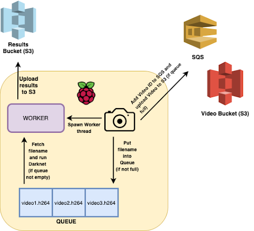

# Video-Object-Detection-As-A-Service
Highly scalable cloud service for object detection in videos, with the help of AWS services and a Raspberry Pi, with the ability to scale out or in using the number of messages in SQS.    
Through this project, we aim to gain an understanding of edge and cloud computing. Edge computing is achieved with the help of Raspberry Pi, which we aim to use as the edge computing device. As the aim of the project is to perform object detection, we will make use of camera module functionality along with Pi. We aim to make adequate use of the resources on Pi as well as of the EC2 instances, which will form the cloud computing component of the project.   
Please refer to the [Report](Report.pdf) for further details into the project and instruction to get set up.

## High Level Architecture

## Video Processing Workflow

## Setup Instructions

### Master Node
- Spawn an EC2 Instance (which would be the master node)
- Assign an IAM role to allow it EC2 Access and SQS Access
- Copy poll_scaling.py, create_instances.py and requirements_master.txt to the EC2 Instance
- Create a Python3 virtual environment using `pip install -p python3 venv`
- Activate the virtual environment using `source venv/bin/activate`
- Run `pip install -r requirements_master.txt` to install all the dependencies
- Run `python create_instances.py <MASTER_INSTANCE_ID>` to start 19 slave instances
- Run `python poll_scaling.py <MASTER_INSTANCE_ID>` to begin the master polling

